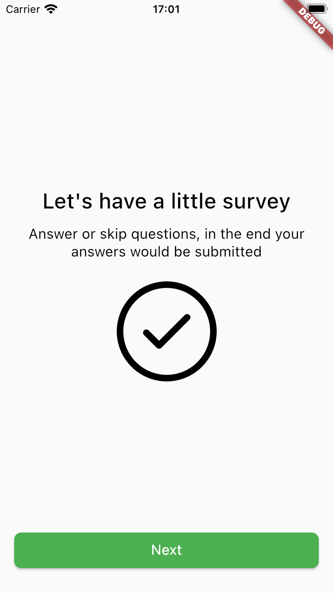

# Survey flow for Flutter


Survey Flow is a Flutter package that provides a framework for creating surveys or quizzes within your app. It allows
you to easily define a survey's structure and customize its appearance, and it includes a range of pre-built widgets to
help you display questions and collect user responses.

Inspired by [survey_kit](https://pub.dev/packages/survey_kit).

## Example

###### Custom design + bottom sheet

<p align="center">
<video src="https://user-images.githubusercontent.com/12810748/226890048-3f8670d7-7191-4e0d-92fb-d45a02b606eb.mp4" width="350"></video>
<video src="https://user-images.githubusercontent.com/12810748/226890839-3e408343-7148-4a01-b59b-705d7de9ebb2.mp4" width="350"></video>
</p>

## Installation

To use Survey Flow in your Flutter app, add it to your `pubspec.yaml` file:

```yaml
dependencies:
   survey_flow: ^latest_version
```

Then, run `flutter pub get` to download the package.

# Usage

To use Survey Flow, import the package in your Dart code:

```dart
import 'package:survey_flow/survey_flow.dart';
```

## Creating a Survey

To create a survey, use the one of the `SurveyStep` classes or create your own:

```dart

final List<SurveyStep> steps = [
   InformationStep(
      title: 'Information title',
      description: 'Bla bla bla description for this step',
      image: StepImage.svg(
         'https://www.svgrepo.com/show/24762/round-done-button.svg',
         source: StepImageSource.network,
         width: 0.3,
      ),
      primaryButton: StepButton(
         action: 'action:notificationsPermission',
         text: 'Next',
      ),
   ),
];
```

Predefined step types and components documentation you can find below.
More examples you can find in
this [Example repository](https://github.com/theRealGetman/survey-flow/tree/master/example).

## Displaying a Survey

To display a survey, use the `SurveyFlow` widget:

```dart
class MySurveyScreen extends StatefulWidget {
   @override
   _MySurveyScreenState createState() => _MySurveyScreenState();
}

class _MySurveyScreenState extends State<MySurveyScreen> {
   final List<SurveyStep> survey = // create your survey here

   @override
   Widget build(BuildContext context) {
      return Scaffold(
         appBar: AppBar(title: Text('My Survey')),
         body: SurveyFlow(
            initialSteps: survey,
            onSubmit: (results) {
               // handle the survey results here
            },
            onFinish: () {
               // handle the survey finished here
            },
         ),
      );
   }
}
```

In this example, we've created a screen that displays a `SurveyFlow` widget with our `SurveyStep`s, an `onSubmit`
callback that will be called when user submits the last step or some step has a `submit` action (you can find how
actions works in the documentation below) and `onFinish` callback that will be called when the user completes the
survey.

## Displaying a modal Survey

To display a modal survey, use the `showModalSurveyFlow` function:

```dart

final List<SurveyStep> survey = // create your survey here

showModalSurveyFlow(
   context: context,
   initialSteps: survey,
   onSubmit: (results) {
      // handle the survey results here
   },
   onFinish: () {
      // handle the survey finished here
   },
);
```

## Predefined step types:

### `InformationStep`

<p align="center">
</img>
</p>

```dart
InformationStep
(
title: '
Information title
'
,
description: '
Bla bla bla description for this step
'
,
image: StepImage.svg('
https://www.svgrepo.com/show/24762/round-done-button.svg
'
,
source: StepImageSource.network,width: 0.3
,
)
,
primaryButton: StepButton.next()
,
);
```

| Parameter                               |          Default          | Description                                                                        |
|:----------------------------------------|:-------------------------:|:-----------------------------------------------------------------------------------|
| **id** *String?*                        |           Null            | Step id. Can be used for custom steps navigation.                                  |
| **title** *String*                      |         required          | Title that will be displayed on the step.                                          |
| **description** *String?*               |           Null            | Description that will be displayed on the step.                                    |
| **image** *StepImage?*                  |           Null            | Image that will be displayed on the step. Read more about `StepImage` below.       |
| **backgroundImage** *StepImage?*        |           Null            | Image that will be displayed on the background. Read more about `StepImage` below. |
| **primaryButton** *StepButton*          |     StepButton.next()     | Primary button with step action. Read more about `StepButton` below.               |
| **secondaryButton** *StepButton?*       |           Null            | Secondary button with step action. Read more about `StepButton` below.             |
| **buttonsAlignment** *ButtonsAlignment* | ButtonsAlignment.vertical | Defines how buttons should be aligned - vertically or horizontally.                |

### Features:

1) [x] Submit steps result
2) [x] Update steps list
3) [x] Loading state
4) [x] Widgets
   1) [x] Information
   2) [x] Single select
   3) [x] Multi select
   4) [x] Number request
   5) [x] Date request
   6) [x] Text request
5) [x] Custom actions
6) [x] Custom steps
7) [x] Custom styling (use inherited widget theme)
8) [x] JsonSerializable
9) [x] Extend styling for components, check default style
10) [x] Primary button disabled predicate for RequestScreens
11) [x] Custom next step navigation
12) [x] Button navigation conditions
13) [x] Buttons alignment (horizontal / vertical)
14) [x] BottomSheet view

# Contributing

Feel free to contact me (a.e.getman@gmail.com) or create Pull Requests/Issues for this repository :)

# License

Survey Flow is licensed under the [MIT License](https://github.com/theRealGetman/survey-flow/blob/master/LICENSE).